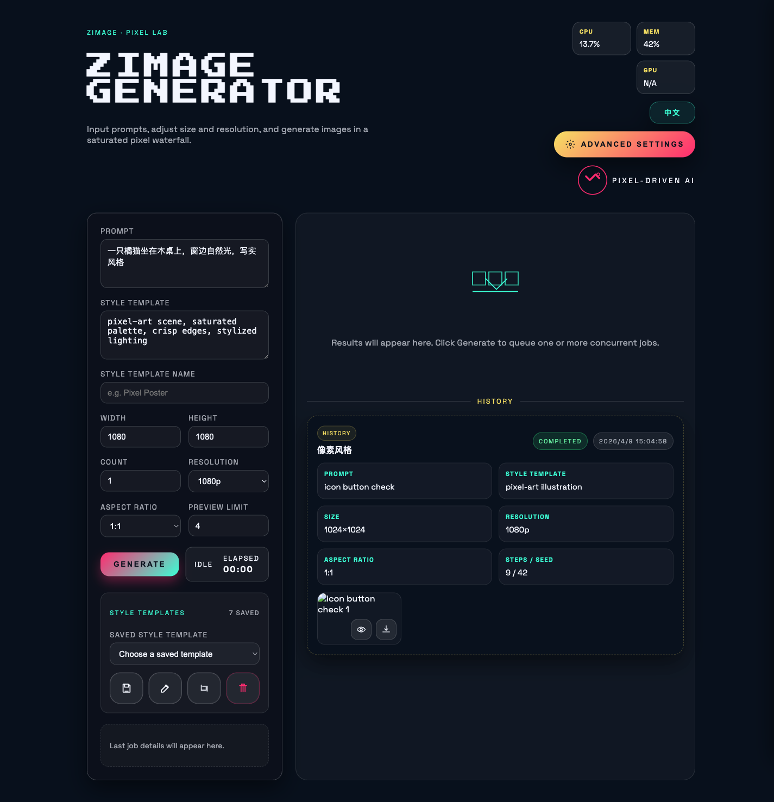
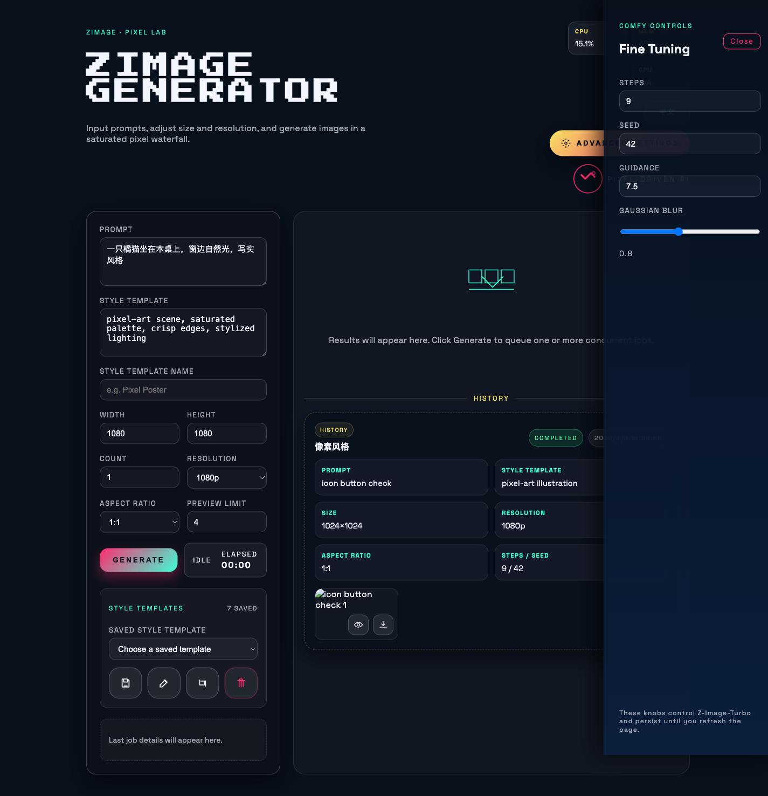

# Zimage WebUI for Mac

<p align="center">
  
</p>

<p align="center">
  <a href="https://github.com/leigegehaha/zimage-webui/blob/main/LICENSE"></a>
  
  
  
  
</p>

一个面向本地运行的 Zimage 网页应用，目标是把 `Zimage` 这样的本地生图模型，封装成一个开箱即用的网页工具。

你不需要去搭复杂的 ComfyUI 工作流，也不需要自己拼一堆节点。只要把项目下载到本地，安装依赖，启动服务，浏览器里就可以直接生成图片。

它更像是一个轻量、本地、可直接操作的 `Zimage WebUI`，而不是一个需要大量前置知识的工作流平台。

## 项目亮点

- 本地优先：下载代码后即可本地启动，不依赖远程网页服务
- 降低门槛：不需要 ComfyUI 节点编排，直接网页操作
- 自动下载模型：模型文件不进仓库，首次运行自动拉取，或通过 `download-model.sh` 一键预下载
- 产品化交互：支持任务队列、历史记录、图片预览、下载、进度条、高级设置
- 可扩展：内置 `skill/` 目录，可把 Zimage 能力继续封装到更大的自动化流程里

## 页面预览

### 主界面


### 高级参数抽屉



## 项目定位

这个项目主要解决三个问题：

1. `Zimage` 模型虽然强，但对很多普通用户来说，原始命令行和工作流方式门槛太高。
2. ComfyUI 很强，但也很重，节点体系复杂，配置和调试成本高，不适合只想快速本地出图的用户。
3. 很多用户真正需要的是一个“下载后即可本地启动”的网页，而不是一个“先学一套工作流语言再生图”的系统。

所以这个项目做的事情是：

- 把 `Zimage` 模型包装成一个网页应用
- 提供简洁的本地启动方式
- 提供常用参数控制，而不是把用户扔进复杂节点图里
- 保留高级参数入口，满足更进阶的调参需求
- 支持本地输出、本地历史记录、本地任务流
- 不上传模型文件本体，而是在本地首次运行时自动下载，或者通过一键脚本预下载

## Zimage 是什么

`Zimage` 是一个先进的图像生成模型，适合本地文生图场景。这个项目当前基于 `mflux` 生态下的 `z-image-turbo` 变体进行封装，在 Apple Silicon 的本地环境里可以直接运行。

它的特点可以概括为：

- 本地运行，不依赖远程网页平台
- 出图速度相对友好，适合快速实验
- 适合配合 Prompt、风格模板和参数调节做连续创作
- 对内容限制更少，适合做更自由的本地探索

关于这一点需要说明：

- 这个项目是本地运行工具，不内置线上平台那类强审核链路
- 因此模型可能生成更成人向、边界更宽的内容
- 示例可以在你本地的 `output/` 目录中自行查看
- 这里不展开描述具体内容，但请确保你的使用符合法律法规以及你所在平台、地区和设备环境的要求

## 这个项目有什么价值

相比直接使用 ComfyUI，这个项目更强调：

- 更低门槛
- 更快上手
- 更明确的功能边界
- 更适合“我就是要本地开网页直接生图”的场景

如果你的目标是：

- 想在 Mac 上本地跑 Zimage
- 想通过网页输入提示词直接出图
- 想调尺寸、比例、张数、分辨率
- 想看任务进度、历史记录和结果预览
- 不想折腾复杂的 ComfyUI 节点工作流

那么这个项目就是为这种需求设计的。

## 功能特性

### WebUI 能力

- 提示词输入
- 风格模板输入与模板复用
- 自定义宽高
- 比例选择
- 分辨率选择：`1080p` / `2K` / `4K`
- 同时生成多张图片
- 非阻塞任务队列
- 任务进度条
- 生成耗时统计
- 历史记录展示
- 图片预览
- 图片下载
- 取消任务

### 高级设置

- 步数 `steps`
- 种子 `seed`
- 引导强度 `guidance`
- 高斯后处理 `gaussian`

### UI 特性

- 单页应用
- 像素风、高饱和度界面
- 类似瀑布流的结果布局
- 中英双语切换
- 状态颜色区分
- 历史记录与生成参数关联展示

### Skill 能力

项目内还额外提供了一个 `skill/` 目录，用于把 Zimage 封装成可复用的 skill：

- 根据提示词直接生成图片
- 若未指定比例，要求先询问比例
- 默认分辨率 `1080p`
- 高级参数写在 `skill/skim/config.json`
- 图片输出到 `skill/output/`

## 项目结构

```text
zimage/
├── app/
│   └── server.py
├── web/
│   ├── index.html
│   ├── styles.css
│   └── app.js
├── skill/
│   ├── SKILL.md
│   ├── skim/
│   │   └── config.json
│   ├── scripts/
│   │   └── generate.py
│   └── output/
├── output/
├── download-model.sh
├── run-zimage.sh
├── start-webapp.sh
├── requirements.txt
└── README.md
```

## 运行环境

当前项目主要面向：

- macOS
- Apple Silicon
- Python 3.11+ / 3.12+

模型运行基于：

- `mflux`
- `carsenk/z-image-turbo-mflux-8bit`

## 快速开始

### 1. 克隆项目

```bash
git clone https://github.com/leigegehaha/zimage-webui.git
cd zimage-webui
```

### 2. 创建虚拟环境

```bash
python3 -m venv .venv
source .venv/bin/activate
```

### 3. 安装依赖

```bash
pip install -r requirements.txt
```

### 4. 启动网页应用

```bash
chmod +x start-webapp.sh
./start-webapp.sh
```

浏览器打开：

```text
http://127.0.0.1:8765
```

## 首次使用会发生什么

首次生成时，`mflux` 会自动下载模型权重到本地缓存目录：

- `hf-cache/`

因此首次启动会慢一些，这是正常现象。后续运行会复用本地缓存。

## 模型下载方式

这个仓库不会上传模型文件本体，只上传代码。

你有两种方式获取模型：

### 方式 1：首次运行自动下载

第一次点击生成时，底层会自动把模型下载到：

- `hf-cache/`

这是默认行为，也是最省事的方式。

### 方式 2：手动执行一键下载脚本

如果你希望先把模型下好，再交给客户使用，可以直接运行：

```bash
chmod +x download-model.sh
./download-model.sh
```

下载完成后，模型会被缓存到：

- `hf-cache/`

脚本本质上是提前把 `carsenk/z-image-turbo-mflux-8bit` 拉到本地缓存中，因此后续第一次打开网页生成时，就不会再重复下载。

## 命令行生图

如果你不想打开网页，也可以直接用命令行：

```bash
chmod +x run-zimage.sh
./run-zimage.sh --prompt "一只橘猫坐在木桌上，窗边自然光，写实风格"
```

### 常见示例

默认尺寸：

```bash
./run-zimage.sh --prompt "一只橘猫坐在木桌上，窗边自然光，写实风格"
```

自定义尺寸和输出文件名：

```bash
./run-zimage.sh --prompt "海报风格的城市夜景" --width 768 --height 1344 --output poster.png
```

批量生成：

```bash
./run-zimage.sh --prompt "电影感雪山湖泊" --count 4
```

批量生成并自定义前缀：

```bash
./run-zimage.sh --prompt "产品渲染图，白底" --count 3 --prefix product
```

## Skill 用法

### 配置文件

编辑：

- `skill/skim/config.json`

这里可以修改：

- 默认分辨率
- 默认比例
- 步数
- 种子
- guidance
- gaussian
- 输出目录

### 调用 skill 脚本

```bash
python3 skill/scripts/generate.py \
  --prompt "测试图片，像素风格小机器人，霓虹背景，高饱和度" \
  --aspect-ratio 1:1
```

多张输出：

```bash
python3 skill/scripts/generate.py \
  --prompt "像素风格未来街景" \
  --aspect-ratio 16:9 \
  --count 4
```

## WebUI 设计说明

这个项目不是简单地把模型包一层按钮，而是做了偏产品化的本地交互：

- 生成过程非阻塞
- 可以连续提交多个任务
- 任务有独立卡片、进度和状态
- 结果以 4 列预览为主
- 历史记录会保留生成参数
- 高级设置通过抽屉打开，而不是堆满主界面

这样做的目的，是在“足够简单”和“仍然可控”之间找到一个实用平衡点。

## 关于内容自由度

再次强调，这个项目的定位是：

- 本地运行
- 本地出图
- 用户自行控制提示词与参数

它不是一个线上内容平台，因此不会天然带有完整的远程审核链路。也正因如此，它更适合研究、实验与私有创作，但也更需要使用者自己承担合规、伦理和内容管理责任。

如果你需要高度受限、强审核、适合公开平台分发的生成链路，这个项目并不是那类产品。

## 已知说明

- `1080p` 代表目标分辨率档位，不一定严格等于最终像素
- 底层模型可能会把尺寸自动调整为 `16` 的倍数
- 比如 `1080x1080` 可能最终落盘为 `1072x1072`
- 首次出图会慢，因为需要下载模型
- `hf-cache/` 体积会比较大，默认不建议提交到 Git
- 仓库中不会包含模型文件本体，模型通过首次运行自动下载或 `download-model.sh` 获取

## 为什么不直接用 ComfyUI

不是因为 ComfyUI 不好，而是目标不同。

ComfyUI 更适合：

- 工作流深度编排
- 多模型串联
- 复杂节点实验
- 精细控制整条推理流程

而这个项目更适合：

- 直接本地跑 Zimage
- 不想搭节点
- 希望下载安装后就能开网页
- 想让家人、朋友或非技术用户也能直接使用

它更像一个专注于 `Zimage` 的本地应用层，而不是通用工作流平台。

## 适合谁

- 想在 Mac 上本地体验 Zimage 的用户
- 不想使用 ComfyUI 的用户
- 想快速验证 Prompt 的创作者
- 想把本地生图能力封装给团队或朋友使用的人
- 想把 Zimage 包装成网页产品原型的人

## 后续可以扩展什么

- 更多模型切换
- LoRA 支持
- 图生图
- 批量模板库
- WebSocket 实时日志
- 更完整的任务持久化
- Docker 化部署
- Windows / Linux 兼容层

## 免责声明

本项目仅用于本地研究、学习、实验与个人创作用途。

请不要用它生成、传播或分发违法内容，也不要将其用于侵犯他人权益的场景。模型生成内容及其后果由实际使用者自行负责。
